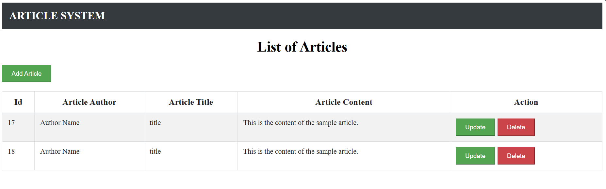
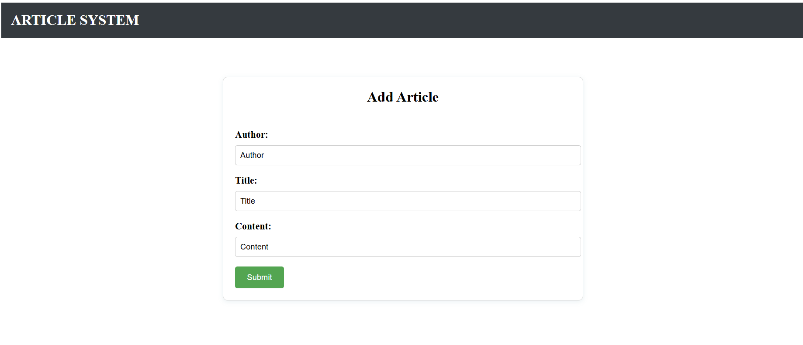
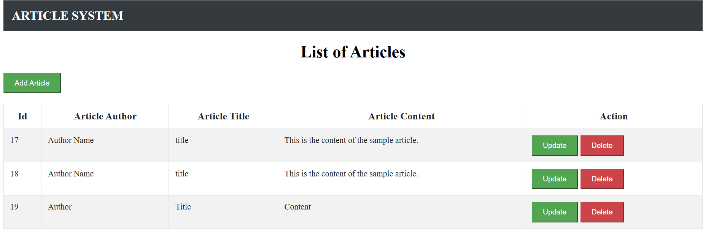
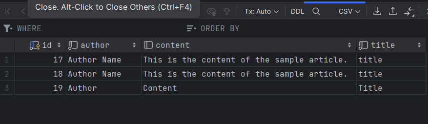
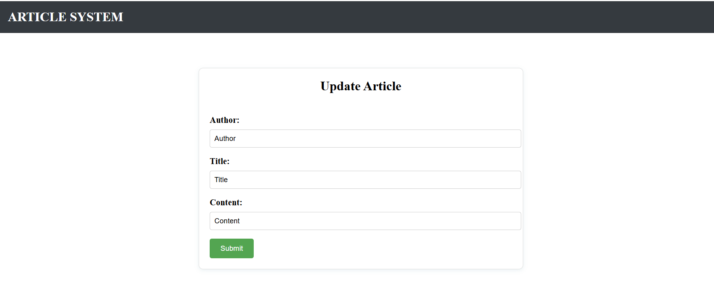
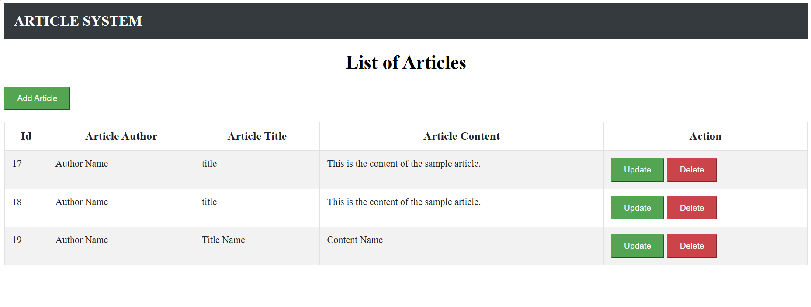
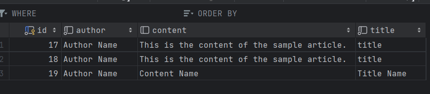
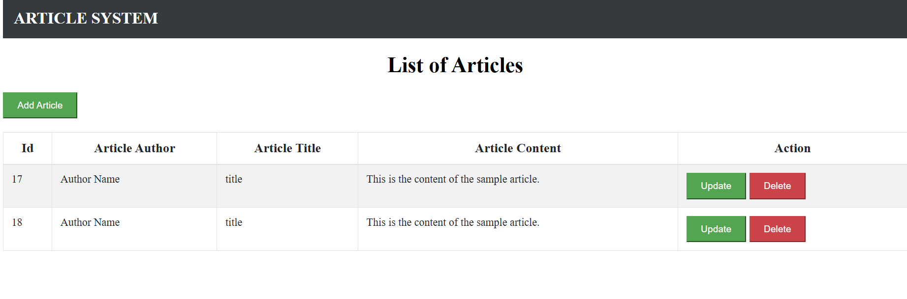
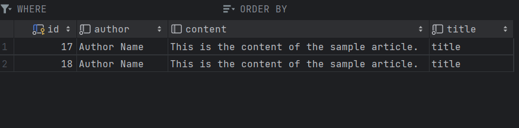

Ilk olaraq, http://localhost:5173/ linkine daxil oluruq ve asagidaki kimi sehife acilir.

Biz burda 3 button goruruk
1) ADD - Yeni article elave etmek ucun istifade edilir ve icerisine melumatlar elave olunur.
2) UPDATE - add olunmus melumatlari yenisi ile evez etmek meqsedi ucun istifade edirik.
3) DELETE - article-i silmek ucun istifade edirik.

1)biz yeni article elave etdik ve submit edirik

id-19 yaranir 

biz bunu bizim backendde mysql database-de yarandigini gore bilerik

2)Eger biz article melumatlarini deyisemk isteyirikse, update butonundan istifade ederik ve biz id ile olan getmethodundan istifade ederek bizim evvelki melumatlar ekranda gorunur

Daha sonra biz melumati deyiserek update edirik.(Mes: evvel Autthor olan setri Author NAme etdik)

Database-de melumatin deyisdiyisini goruruk

3)Daha sonra biz melumati id gore silmek istesek, delete butonundan istifade edirik

id=19 beraber olan field silinir
Databasede de gore bilirik
